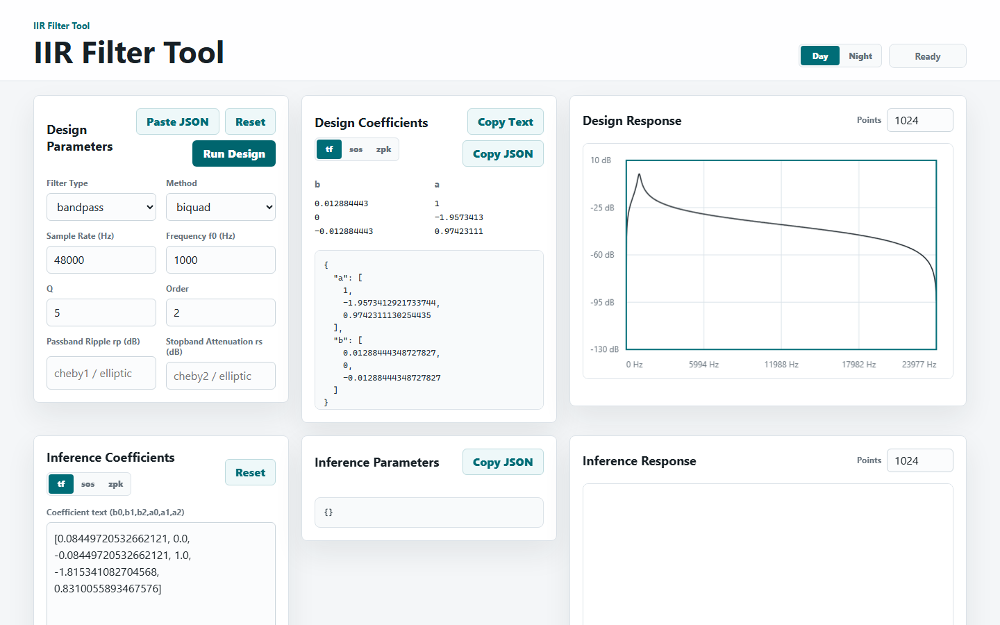
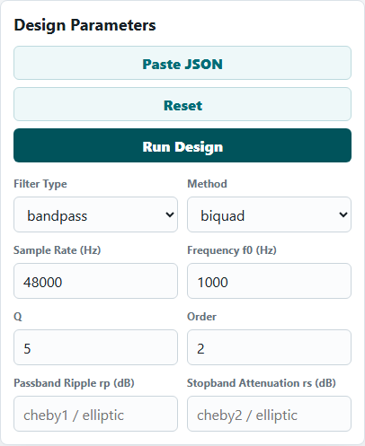
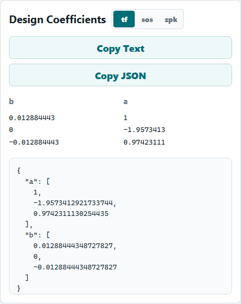
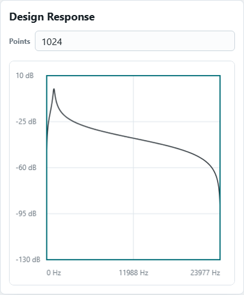

# IIR Filter Tool

IIR Filter Tool 是一個用 Python 建立的數位 IIR 濾波器設計與分析工具。它可以透過 Python API、Flask Web UI、JSON API，以及可部署到 GitHub Pages 的靜態 demo 來設計濾波器、檢視頻率響應，並從既有係數推估濾波器參數。

## 功能

- 支援 `lowpass`、`highpass`、`bandpass`、`notch` 濾波器類型。
- 支援 RBJ `biquad`，以及 SciPy 提供的 `butterworth`、`cheby1`、`cheby2`、`elliptic`、`bessel` 設計方法。
- 可從 `b` / `a` 傳遞函數係數推估濾波器類型、中心或截止頻率、Q 值、階數、漣波、阻帶衰減與極零點。
- Web UI 可輸入設計參數、顯示係數、繪製 magnitude response，並從係數進行推估。
- JSON API 適合接到其他工具或前端。
- 靜態 demo 可建置到 `site/`，並透過 GitHub Pages 發布。

## 安裝

建議使用虛擬環境：

```powershell
python -m venv .venv
.\.venv\Scripts\Activate.ps1
python -m pip install -r requirements.txt
```

如果系統的 `python` 不在 `PATH`，Windows 也可以使用 Python launcher：

```powershell
py -m pip install -r requirements.txt
```

專案依賴列在 [requirements.txt](requirements.txt)：

- `numpy`
- `scipy`
- `matplotlib`
- `flask`

## Python API

執行範例：

```bash
python example.py
```

基本用法：

```python
from iir_filter import design_iir, infer_iir_params, plot_response

fs = 48000
params = {
    "ftype": "bandpass",
    "method": "biquad",
    "f0": 1000,
    "Q": 5,
    "order": 2,
}

b, a = design_iir(params, fs=fs)
print("b:", b)
print("a:", a)

inferred = infer_iir_params(b, a, fs)
print(inferred)

plot_response(b, a, fs=fs, title="Bandpass response")
```

## Web UI

啟動 Flask Web App：

```bash
python web_app.py
```

開啟 [http://127.0.0.1:5000](http://127.0.0.1:5000)。如果 `5000` 已被佔用，程式會嘗試使用 `5001`。

也可以指定連接埠：

```powershell
$env:PORT = "5050"
python web_app.py
```

Makefile 提供幾個常用入口：

```bash
make run
make web
make pages-demo
```

### 輸入參數並取得曲線

電腦版：



手機版：

參數輸入：



係數輸出：



曲線顯示：



## JSON API

### `POST /api/design`

依參數設計濾波器，回傳係數與頻率響應。

Request:

```json
{
  "ftype": "bandpass",
  "method": "biquad",
  "fs": 48000,
  "f0": 1000,
  "Q": 5,
  "order": 2,
  "rp": null,
  "rs": null
}
```

Response:

```json
{
  "b": [0.0127622136, 0.0, -0.0127622136],
  "a": [1.0, -1.9567614225, 0.9744755728],
  "response": {
    "frequency_hz": [0.0, 23.4375],
    "magnitude_db": [-320.0, -32.4]
  }
}
```

`response.frequency_hz` 與 `response.magnitude_db` 實際會各回傳 1024 個點。

### `POST /api/infer`

從既有 `b` / `a` 係數推估濾波器參數，並回傳該係數的頻率響應。

Request:

```json
{
  "b": [0.01276221, 0, -0.01276221],
  "a": [1, -1.95676142, 0.97447558],
  "fs": 48000
}
```

Response 會包含：

- `inferred`: 推估出的描述性參數。
- `response.frequency_hz`: 頻率軸資料。
- `response.magnitude_db`: magnitude response，以 dB 表示。

## 參數說明

- `fs`: 取樣率，單位 Hz，預設為 `48000`。
- `f0`: cutoff 或 center frequency，必須大於 0 且低於 Nyquist frequency，也就是 `fs / 2`。
- `Q`: bandpass、notch 與 RBJ biquad 會使用的品質因數。SciPy-backed 的 bandpass/notch 會用 `Q` 推算頻帶邊界。
- `order`: 濾波器階數。RBJ `biquad` 必須使用 `order=2`。
- `rp`: Chebyshev I 與 Elliptic 的 passband ripple，單位 dB。
- `rs`: Chebyshev II 與 Elliptic 的 stopband attenuation，單位 dB。
- `norm`: Bessel 設計可使用 `phase`、`delay` 或 `mag`，預設為 `phase`。

## 支援的設計方法

| Method | 說明 | 必要參數 |
| --- | --- | --- |
| `biquad` | RBJ biquad 設計 | `ftype`, `f0`, `Q`, `order=2` |
| `butterworth` | SciPy Butterworth | `ftype`, `f0`, `order` |
| `cheby1` | SciPy Chebyshev I | `ftype`, `f0`, `order`, `rp` |
| `cheby2` | SciPy Chebyshev II | `ftype`, `f0`, `order`, `rs` |
| `elliptic` | SciPy Elliptic | `ftype`, `f0`, `order`, `rp`, `rs` |
| `bessel` | SciPy Bessel | `ftype`, `f0`, `order`, optional `norm` |

`butter` 是 `butterworth` 的別名，`ellip` 是 `elliptic` 的別名，`bandstop` 會被視為 `notch`。

## GitHub Pages 靜態 Demo

GitHub Pages 不能直接執行 Flask server，因此專案提供靜態 demo 建置腳本。它會把 CSS、demo JavaScript、預先計算的範例資料，以及必要的 Python 設計與推估邏輯輸出到 `site/`。

```bash
python scripts/build_pages_demo.py --output site
```

本 repo 已包含 `.github/workflows/pages.yml`。推送到 `main` 或 `master` 時，workflow 會安裝依賴、執行測試、建置 `site/`，再部署到 GitHub Pages。

## 測試

```bash
python -m unittest discover -s tests
```

測試涵蓋：

- IIR 設計與參數驗證。
- RBJ biquad 係數反推。
- SciPy-backed 濾波器分析 metadata。
- Flask JSON API。
- GitHub Pages 靜態 demo 建置結果。

## 專案結構

```text
iir_filter/
  design.py      # IIR filter design
  infer.py       # coefficient analysis and parameter inference
  plot.py        # Matplotlib response plotting
example.py       # Python API example
web_app.py       # Flask Web UI and JSON API
scripts/         # GitHub Pages static demo builder
templates/       # Flask HTML template
static/          # CSS and browser JavaScript
tests/           # unit tests
site/            # generated static demo output
```

## 注意事項

- `infer_iir_params` 是 best-effort 分析工具。RBJ biquad 通常可以精準回推；SciPy prototype 濾波器多半只回傳 analysis-only metadata。
- `notch` 在 SciPy-backed 設計路徑中會映射為 `bandstop`。
- Web API 的數值輸出會轉成 JSON-safe 格式，非有限浮點值會轉成 `null`。
